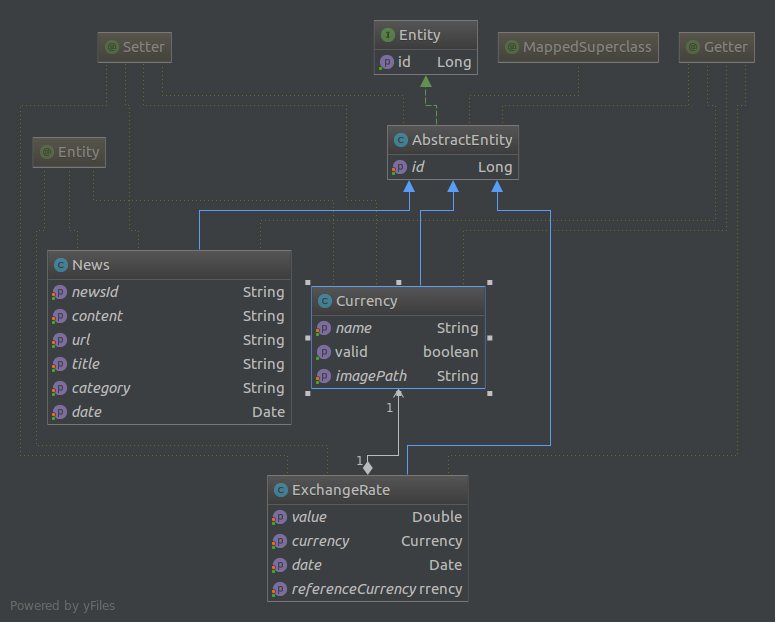
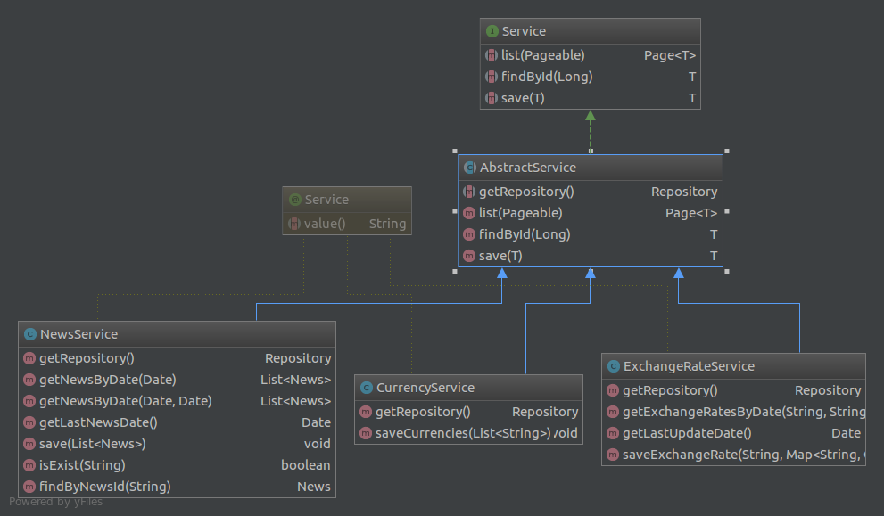

# Restful Currency and Exchange Rate Service

[](https://travis-ci.org/OnurKaraduman/kassandra)

This is the web service of the kassandra.


### Technology stack
* [Spring Boot](http://projects.spring.io/spring-boot/)
* [Spring JPA Data](http://projects.spring.io/spring-data-jpa/)
* Spring Jersey
* [Spring HATEOAS](http://projects.spring.io/spring-hateoas/)
* [MySQL](https://www.mysql.com/)
* [Lombok](https://projectlombok.org/)
* [AssertJ](http://joel-costigliola.github.io/assertj/)
* [Dozer](http://dozer.sourceforge.net/documentation/usage.html)

### Integration
* Integrated with [http://fixer.io/](fixer.io)
* Integrated with [https://developers.hurriyet.com.tr/](HurriyetApi)

### Software Design Overview

#### Data Structure

 The following screenshot shows the data structure:
 
 
 
 #### Business Layer
 
  
  
  ### Building
  
  ##### Using Maven
  
  ````sh
  mvn clean install
  ````
  
  ### Running 
  
  
  ##### Using Maven
  Before running, please set the following environment variable with Hurriyet api key :
  ````
  NEWS_API_KEY
  ````
  
  **With Production environment**
  
  Before running with prod, you should create database in mysql:
  
  ````
  create database kassandra;
  ````
  
  ````sh
  mvn spring-boot:run
  `````

  ### Packaging
  
  ##### Using Maven
  
  ```` sh
  mvn package
  ````
  
  ### Usage